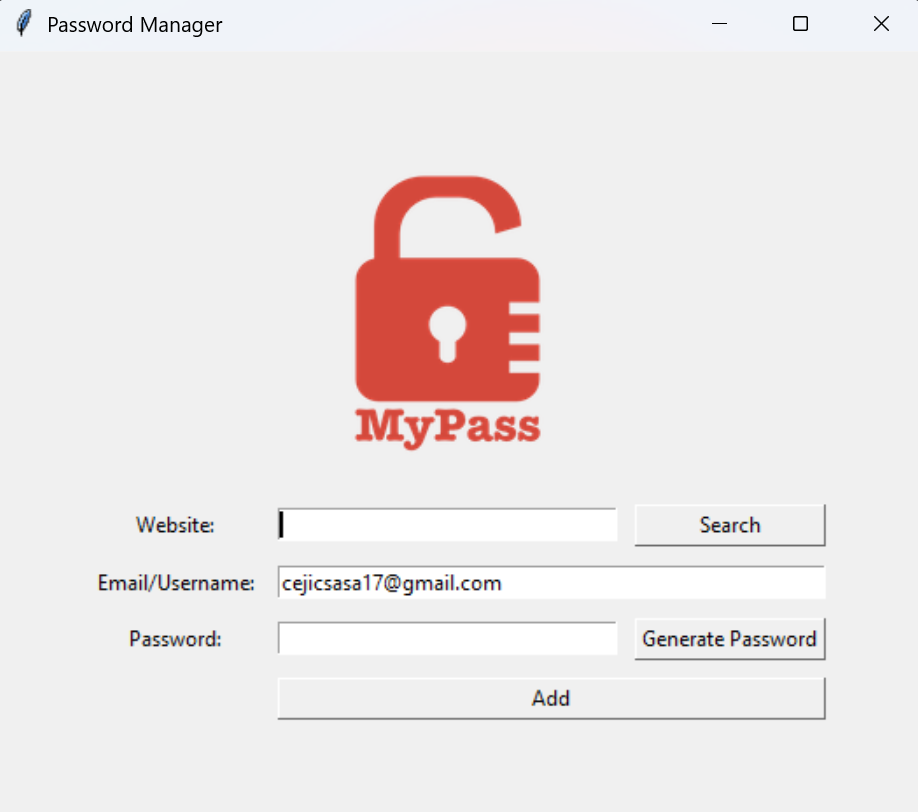

# 🔐 Password Manager

A secure **Password Manager** built with **Python** and **Tkinter**.  
This application allows users to **generate strong passwords**, store them safely in a **JSON file**, and easily retrieve them later.

---

## ✨ Features

- **Password Generator**  
  - Creates strong, random passwords with a mix of letters, numbers, and symbols.  
  - Passwords are automatically copied to your clipboard for convenience.  

- **Save Credentials**  
  - Stores website, email/username, and password in a `data.json` file.  
  - Confirms details with the user before saving.  
  - Prevents accidental overwrites by merging data when the same website already exists.  

- **Search Functionality**  
  - Quickly retrieve saved credentials by typing the website name.  
  - Displays stored email/username and password in a pop-up.  

- **Simple UI**  
  - Built with **Tkinter** for an intuitive interface.  
  - Includes input fields for website, email/username, and password.  
  - Buttons for password generation, saving, and searching.  

---

## 🛠️ Technologies Used

- [Python 3](https://www.python.org/)  
- [Tkinter](https://docs.python.org/3/library/tkinter.html) – for the graphical user interface  
- [Pyperclip](https://pypi.org/project/pyperclip/) – for copying passwords to clipboard  
- [JSON](https://docs.python.org/3/library/json.html) – for secure data storage  

---

## 📂 Project Structure

```
.
├── data.json          # Stores saved credentials securely
├── logo.png           # App logo displayed in the UI
├── screenshot.png     # Screenshot of the app UI
├── main.py            # Main application file
├── requirements.txt   # Dependencies
├── LICENSE
└── README.md          # Project documentation
```

---

## 🚀 Getting Started

### 1. Clone the Repository
```bash
git clone https://github.com/SasaCejic/password-manager.git
cd password-manager
```

### 2. Install Dependencies
```bash
pip install -r requirements.txt
```

### 3. Run the Application
```bash
python main.py
```

---

## 📖 Usage

1. Enter the **Website** and **Email/Username**.  
2. Click **Generate Password** to create a random secure password.  
   - The password will also be copied to your clipboard.  
3. Click **Add** to save the credentials into `data.json`.  
4. Use the **Search** button to retrieve stored credentials for a specific website.  

---

## 📸 Screenshot

<p align="center">
  
</p>

---

## ⚠️ Disclaimer

This project is for **educational purposes** only.  
Although credentials are saved in JSON instead of plain text, this is **not fully secure** for production use.  
For real-world applications, consider:  
- Encrypting stored data  
- Using a secure database or password vault  
- Adding authentication before accessing saved data  

---

## 📌 Future Improvements

- Encrypt stored passwords.  
- Add master password protection.  
- Improve UI/UX with themes.  
- Add option to delete or edit saved credentials.  

---

## 👨‍💻 Author

Developed by **Saša Čejić**  
📧 Contact: cejicsasa17@gmail.com  

---

## 📝 License

This project is licensed under the MIT License.  
Feel free to use and modify for personal or educational purposes.
